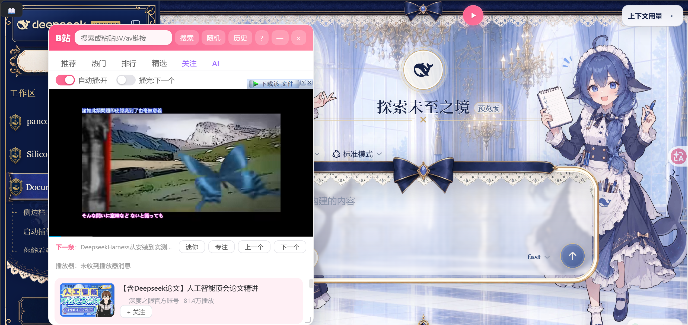
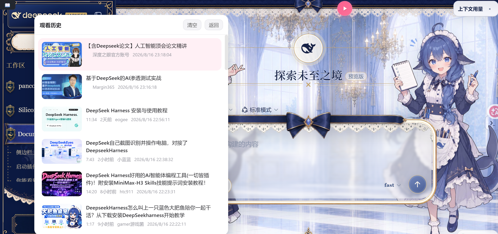
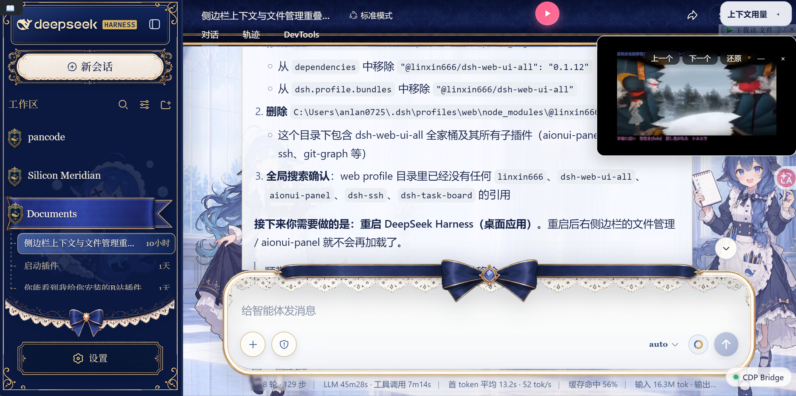
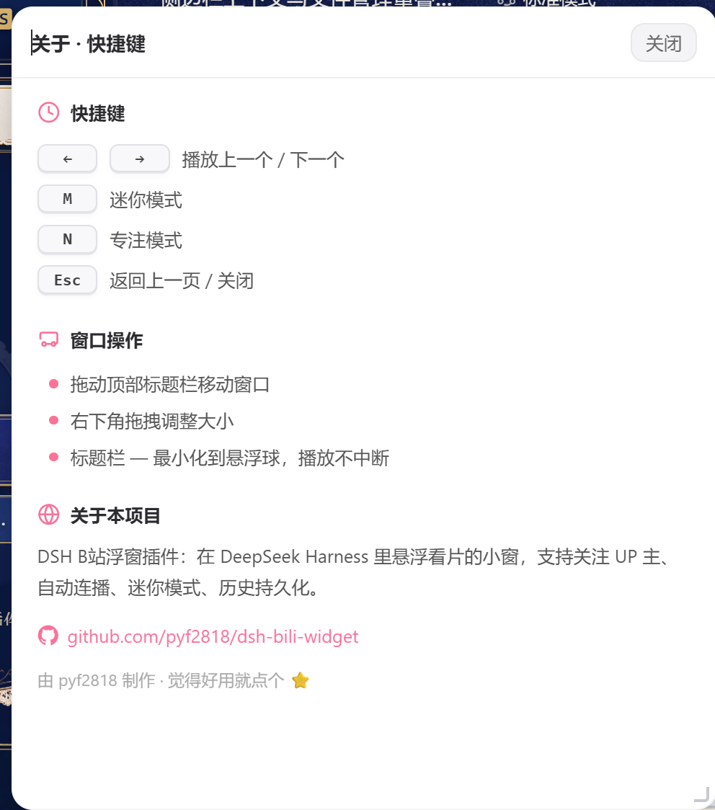

<div align="center">

# 🎬 DSH B站浮窗插件

**在 DeepSeek Harness (DSH) 里悬浮看片的 B 站小窗** — 边 coding 边刷视频，专注摸鱼，快乐加倍 🐟

[](LICENSE)
[](https://github.com/pyf2818/dsh-bili-widget)

</div>

## ✨ 为什么值得装

在 DSH 里挂一个 **永远置顶、可拖动缩放、自动连播** 的 B 站小窗。写代码写累了，随手点开一个视频边听边写；摸鱼看番也不会被打扰——**窗口永远在最上层，全屏也不丢**。

## 📸 截图

### 主界面



在 DSH 里悬浮一个 B 站小窗，推荐 / 热门 / 排行 / 精选 / 关注 / AI 六个频道，列表内直接播放，无缝切换。

### 观看历史



自动记录观看历史，本地持久化存储，重启 DSH 不丢失。

### 迷你模式



一键最小化到悬浮球，视频继续后台播放；点击悬浮球恢复窗口，进度完整保留。

### 快捷键面板



快捷键一目了然：`←`/`→` 上下曲、`M` 迷你、`N` 专注、`Esc` 返回/关闭。

## 🚀 功能一览

### 🎯 内容发现
| 能力 | 说明 |
|------|------|
| **6 大频道** | 推荐 / 热门 / 排行 / 精选 / 关注 / AI，45 个话题 chip 快速切入 |
| **搜索** | 支持视频/番剧/UP主/影视，BV/av 号直达，搜索历史持久化 |
| **⭐ 关注 UP 主** | 一键关注，专属频道聚合你关注的 UP 主视频，追更不迷路 |

### 🎮 播放体验
| 能力 | 说明 |
|------|------|
| **自动连播** | 播完自动切下一个，或单集重播，无缝摸鱼 |
| **迷你 / 专注模式** | 迷你小窗仅 300×180，专注模式纯播放器 |
| **➖ 窗口最小化** | 一键最小化到悬浮球，视频继续播放，点球恢复 |
| **悬浮球** | 可拖动、可点击，点开/收起窗口不打断播放 |

### 🛠 工程细节
| 能力 | 说明 |
|------|------|
| **💾 数据持久化** | 关注列表 + 观看历史存服务端文件，**重启 DSH 不丢失** |
| **已看标记** | 播放过的视频自动打「已看」，不重复追 |
| **骨架屏 + 重试** | 加载动画、错误重试按钮，体验顺滑 |
| **快捷键** | `←`/`→` 上一个/下一个 / `M` 迷你 / `N` 专注 / `Esc` 返回 |

## 📦 安装

### 方式一：DSH 内直接说（推荐）

在 DSH 对话里输入：

> 请安装 https://github.com/pyf2818/dsh-bili-widget 这个插件

DSH 会自动完成安装，重启后即可在侧边栏找到「B站」。

### 方式二：手动安装

在你的 DSH profile 的 `package.json` 中添加：

```json
{
  "dependencies": {
    "@dsh-external/dsh-bili-widget": "github:pyf2818/dsh-bili-widget"
  },
  "dsh": {
    "profile": {
      "bundles": [
        "@dsh-external/dsh-bili-widget"
      ]
    }
  }
}
```

然后 `pnpm install` 并重启 DSH。

## ⌨️ 快捷键

> 在窗口标题栏点击 `?` 按钮，随时可以查看这份快捷键表。

| 按键 | 功能 |
|------|------|
| `←` / `→` | 播放上一个 / 下一个 |
| `M` | 切换迷你模式 |
| `N` | 切换专注模式 |
| `Esc` | 返回上一页 / 关闭 |
| 标题栏 `—` | 最小化到悬浮球（视频继续播放，点球恢复） |

## 🖥 环境要求

- **Windows**（使用 `curl.exe` / `powershell.exe` 作为网络子进程）
- **DSH 桌面应用**（web profile）

## 🤝 参与贡献

欢迎 PR！有想法可以在 [Issues](https://github.com/pyf2818/dsh-bili-widget/issues) 提。

- 想加新频道 / 新话题？
- 想适配 Linux/macOS？
- 想要弹幕同步？

## 📄 许可证

[MIT](LICENSE)

---

<div align="center">

**如果这个插件帮到了你，点个 ⭐ 支持一下！** ⭐

</div>
